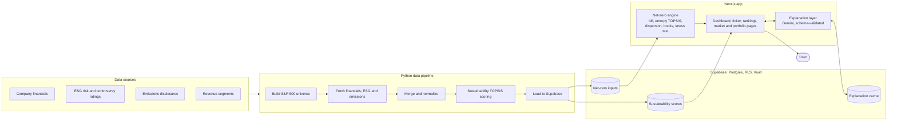
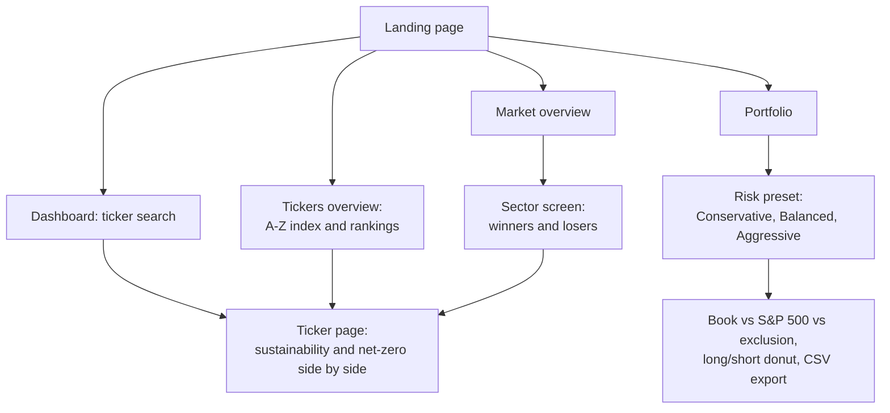

# Meridian

**Score today. Stress-test tomorrow. Invest accordingly.**

Meridian is a platform that scores sustainability, stress-tests net-zero scenarios and builds portfolios for all 503 S&P 500 constituents. Built for ETHack Challenge #1.

**Live demo:** [hackathon-starter-one-beta.vercel.app](https://hackathon-starter-one-beta.vercel.app)

---

## Overview

Every public company will eventually face the cost of decarbonizing. Meridian answers two related but distinct questions about each company in the S&P 500:

1. **How sustainable is this company today?** A 0–100 score built from seven financial and ESG variables, benchmarked against the best and worst performers in the index.
2. **What happens to this company the day the world commits to net zero?** A bottom-up estimate of its decarbonization bill, how many years of earnings that bill represents, and which revenue lines are exposed or stand to benefit.

Both answers feed a portfolio construction workflow. You pick a risk profile and get a long-only book (or a long/short book) benchmarked against the S&P 500, then see how it compares with a simple exclusion strategy.

## Key features

### Tool 1: Sustainability Evaluator

- **TOPSIS scoring:** every company is scored 0–100 by its distance to an ideal company and an anti-ideal company across seven normalized variables.
- **Seven variables, three pillars:**
  - Environmental: emissions intensity.
  - Social: ESG risk score and controversy level.
  - Financial/Operational: asset turnover, net margin, FCF margin and net debt/EBITDA.
  - Weights are capped per pillar.
- **Rankings:** overall rank, sector rank, and index and sector percentiles.
- **Decomposition:** pillar scores and a per-variable distance-to-ideal breakdown on every company page.
- **AI analysis card:** a narrative read of the model, schema-validated and cached in Supabase. It covers the thesis, company overview, pillar analysis, leaderboard position, distance to ideal, strengths, weaknesses and trade-offs.

### Tool 2: Net-Zero Scorer

- **Cleanup bill:** emissions are split across five sources (scope 2 electricity, on-site combustion, vehicle fleets, process and fugitive), then priced with marginal abatement costs under low, mid and high scenarios.
- **Transition burden ratio:** the cleanup bill expressed in years of earnings.
- **Revenue exposure:** revenue at risk (fossil-exposed) versus revenue upside (beneficiary).
- **Sector-relative scoring:** entropy-weighted TOPSIS within each sector. Sector dispersion analysis then labels each sector as one where you can "pick winners", where the "whole sector" is hit, or where it is "barely affected".
- **Portfolio construction:** a long-only book measured against the benchmark, with an optional long/short book.
- **Stress testing:** a Monte Carlo sensitivity run applies ±50% cost shocks to check which picks stay robust.
- **Risk presets:** onboarding lets you choose Conservative, Balanced (the default) or Aggressive.
- **Verdicts:** a deterministic BUY / HOLD / SELL call for each company.
- **Grounded explanations:** an explanation layer on top of the quantitative model, built from closed data packets, schema-validated and cached. A deterministic narrative is always available.

## How it works



### User journey



## Methodology in brief

**Sustainability score.** Seven variables are normalized and grouped into three pillars with capped weights. TOPSIS measures each company's distance to a synthetic ideal (best in class on every variable) and to an anti-ideal (worst in class). The score is its relative closeness to the ideal, expressed from 0 to 100.

**Net-zero scenario.**
- **Cleanup bill:** emissions are decomposed into five sources and priced against marginal abatement costs (low, mid and high) to produce a one-time cleanup bill.
- **Transition burden ratio:** the bill expressed in years of earnings.
- **Revenue exposure:** revenue at risk and revenue upside are estimated separately.
- **Scoring:** within each sector, entropy weighting sets each variable's importance objectively, then TOPSIS ranks the companies.
- **Dispersion:** dispersion analysis shows whether the sector rewards stock-picking or moves as a block.

**Verdict rule.**
- **BUY:** the company is in the top third of its sector by composite score, and its revenue at risk is at or below the sector median.
- **SELL:** the company is in the bottom third of its sector by score, or its revenue at risk is above the sector's 75th percentile.
- **HOLD:** everything else.

**Portfolio construction.** Risk presets (Conservative, Balanced and Aggressive) set the dispersion thresholds and active-weight limits. The result is a long-only book, or a long/short book when short selling is allowed. A Monte Carlo sensitivity run with ±50% cost shocks checks which picks hold up.

## Pages tour

| Route | What it shows |
|---|---|
| `/` | Landing page and product overview |
| `/dashboard` | Large ticker search with autocomplete |
| `/ticker/[symbol]` | Sustainability analysis and net-zero screen side by side, each scrolling on its own |
| `/tickers` | A–Z company index, plus a rankings modal (sustainability, net-zero, or both side by side) |
| `/market` | Sector-level net-zero overview |
| `/market/[sector]` | Winners and losers within one sector |
| `/portfolio` | Portfolio construction: risk presets, portfolio vs S&P 500 vs exclusion, over- and underweights, long/short donut chart, CSV export |

## Tech stack

| Layer | Technology |
|---|---|
| App | Next.js 16 (App Router, Cache Components, Turbopack), React 19, TypeScript |
| UI | Tailwind CSS, shadcn/ui |
| Data | Supabase (Postgres, row-level security, Vault for secrets) |
| Pipeline | Python |
| AI | Google Gemini, as an explanation layer over the quantitative model |
| Testing | Vitest, including live read-only integration tests against Supabase |
| Deployment | Vercel |

## Architecture and repo layout

Each tool lives in its own feature folder and shares no code with the other. Pages call only a small, typed data interface for each tool:
- Tool 1: `getSustainabilityScore` and `getSustainabilityRanking`.
- Tool 2: `getNetZeroScenario` and `getNetZeroRanking`.

```
app/(app)/            Next.js pages: dashboard, ticker, tickers, market, portfolio
app/api/              Explanation routes: sustainability-analysis, explain
components/landing/   Landing page
features/
  sustainability/     Tool 1: score data access, variables, AI analysis
  netzero/
    engine/           Pure TypeScript engine: bill, entropy, topsis, dispersion,
                      longOnly, longShort, sensitivity, dashboard presets
    explain/          Verdict rule and grounded explanation layer
data/pipeline/        Python pipeline: universe, financials, social and
                      environmental data, merge, z-scores, Supabase load
supabase/             Schema, RLS policies, Vault-backed secrets
```

## Getting started

```bash
npm install
cp .env.example .env.local   # fill in the values below
npm run dev
```

### Environment variables

| Variable | Used by |
|---|---|
| `NEXT_PUBLIC_SUPABASE_URL` | Supabase client (browser and server) |
| `NEXT_PUBLIC_SUPABASE_PUBLISHABLE_KEY` | Supabase client (browser and server) |
| `SUPABASE_SECRET_KEY` | Server-side Supabase access and Vault-backed secrets |
| `GEMINI_API_KEY` | Sustainability Evaluator's explanation layer |
| `GEMINI_MODEL` | Sustainability Evaluator's explanation layer |

## Testing

```bash
npm test        # Vitest: unit tests plus live, read-only Supabase integration tests
npm run lint
npm run build
```

## Limitations

- Data is a point-in-time snapshot, not real-time.
- Coverage is the S&P 500 only.
- Net-zero scores are relative to each sector, so ranks compare companies within their own sector, not across the index.
- Abatement costs are scenario assumptions, not forecasts.
- Some emissions and segment data are estimated where disclosure is incomplete.
- ESG risk inputs rely on third-party ratings.
- AI narratives explain the model; they are not investment advice.

## Future scope

- Scheduled data refreshes
- Additional indices and regions beyond the S&P 500
- Uploading a custom portfolio for analysis
- Custom abatement-cost scenarios
- Historical backtesting
- Report and PDF export
- Saved user portfolios
- Deeper market-level analytics

## Credits

Built for ETHack Challenge #1.
